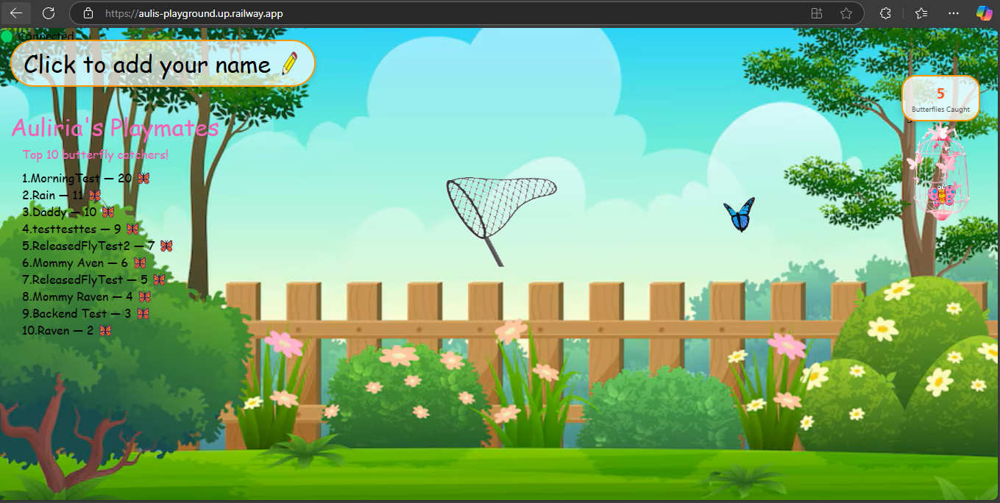

# 🎮 Auli's Playground

A fun butterfly-catching game built with React! Tap or click to catch butterflies, track your score, and climb the leaderboard.

## 🌐 Live Demo

🔗 [Play the game here](https://aulis-playground.vercel.app/)



## 🚀 Features

- 🦋 Interactive butterfly-catching gameplay
- ✏️ Custom player name input
- 📈 Live leaderboard with backend storage
- 🎨 Animated butterflies with natural motion
- 📱 Mobile-friendly design and touch support
- 🔄 Auto-retries on fetch failure
- ✅ Backend health check and status indicator

## 📦 Tech Stack

- React (Frontend)
- RESTful API (Backend hosted on Railway)
- Custom CSS with animations and responsive design

## 🔗 Repositories

- **Frontend GitHub Repo:** [github.com/GeraldTgit/aulis-playground](https://github.com/GeraldTgit/aulis-playground.git)
- **Backend API URL:** [aulis-playground-backend](https://aulis-playground-backend.up.railway.app/)

## 🛠️ Getting Started

### Prerequisites

- Node.js (v14+ recommended)
- npm or yarn

### Installation

1. Clone the repo:

```bash
git clone https://github.com/GeraldTgit/aulis-playground.git
cd aulis-playground
```

````

2. Install dependencies:

```bash
npm install
# or
yarn install
```

3. Create a `.env` file with this content:

```bash
REACT_APP_API_BASE=https://aulis-playground-backend.up.railway.app
```

4. Start the app:

```bash
npm start
# or
yarn start
```

---

## 📱 Mobile Optimization

- Responsive layout with media queries
- Touch-friendly input and drag support
- iOS zoom prevention on inputs

## 📁 Folder Structure

```
src/
├── components/
│   ├── DraggableNet.js
│   └── Butterfly.js
├── App.js
├── App.css
└── index.js
```


````
## 📝 

This project is licensed under the **MIT License**, which means:

- ✅ You can **use**, **copy**, **modify**, and **distribute** the code freely.
- ❌ You **cannot** hold the original authors liable for anything (no warranty).
- 📌 You must include the original license in any copies or distributions.

> It’s a very permissive and developer-friendly license.


Created with 💖 by Gerald T.
