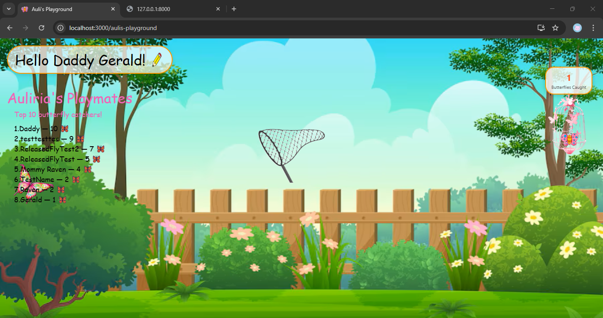
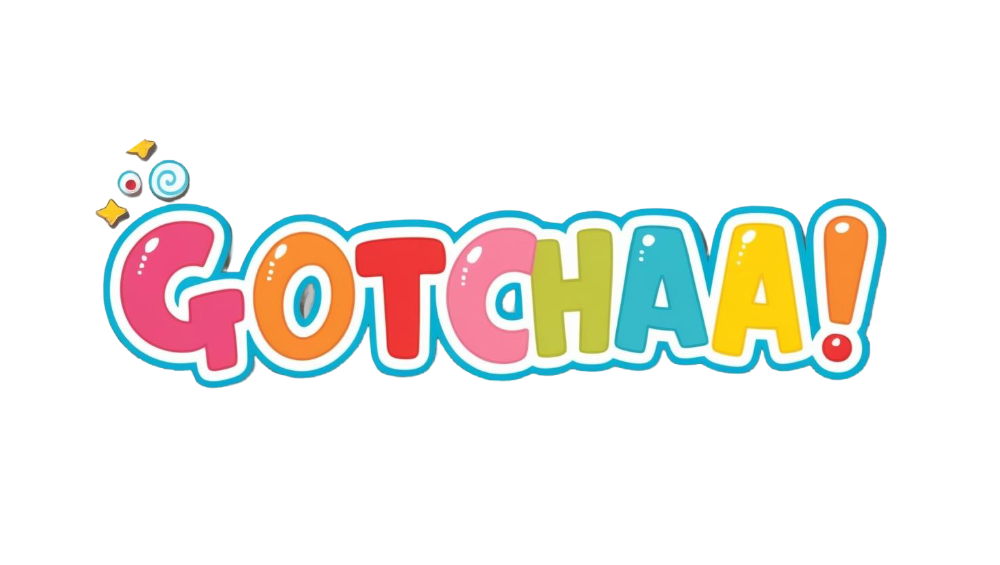

# 🦋 Auli's Playground

**Auli's Playground** is a delightful butterfly-catching game built with React. Drag the net, catch butterflies, and see your name climb the leaderboard!

  
_Fun, simple, and addictive!_

---

## ✨ Features

- 🦋 **Animated Butterflies** – Smooth, lifelike flight patterns.
- 🕸️ **Draggable Net** – Drag and catch butterflies.
- 🧺 **Cage System** – Release butterflies from a cage after catching.
- 🏆 **Leaderboard** – Top 10 butterfly catchers tracked via backend API.
- 👤 **Editable Name Field** – Add your name to be remembered on the board.

---

## 🧰 Tech Stack

- **Frontend**: React, CSS
- **Backend**: Node.js + Express (API)
- **Storage**: JSON (or plug in DB like MongoDB/PostgreSQL)

---

## 🚀 Getting Started

### 1. Clone the Repo

```bash
git clone https://github.com/yourusername/aulis-playground.git
cd aulis-playground
```

### 2. Install Dependencies

```bash
npm install
```

### 3. Run the App

```bash
npm start
```

Frontend runs at: `http://localhost:3000`

---

## 🛠️ Backend Setup

If you don't already have a backend set up, here’s a minimal Express backend you can use:

```bash
cd backend
npm install
node index.js
```

> Backend runs on: `http://localhost:8000`

### Example `index.js`

```js
const express = require("express");
const cors = require("cors");
const app = express();
const port = 8000;

let leaderboard = [];

app.use(cors());
app.use(express.json());

app.get("/", (req, res) => {
  res.json(leaderboard);
});

app.post("/save-session", (req, res) => {
  const { username, caught_butterflies } = req.body;
  leaderboard.push({ username, caught_butterflies });
  leaderboard.sort((a, b) => b.caught_butterflies - a.caught_butterflies);
  leaderboard = leaderboard.slice(0, 10);
  res.json({ message: "Saved", leaderboard });
});

app.listen(port, () =>
  console.log(`Server running at http://localhost:${port}`)
);
```

---

## 📸 Screenshots / GIFs

### 🖱️ Catching a Butterfly



### 🧺 Releasing Butterflies


---

## 📁 Project Structure

```
src/
│
├── components/
│   ├── Butterfly.js
│   └── DraggableNet.js
│
├── App.js
└── App.css
```

---

## ✏️ Contribute

Pull requests are welcome! Suggestions and bug reports too.
